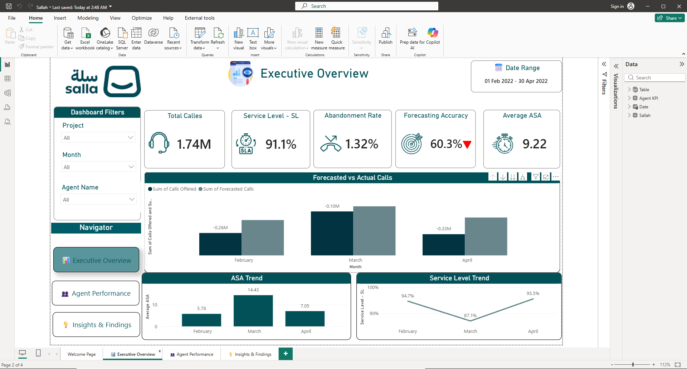
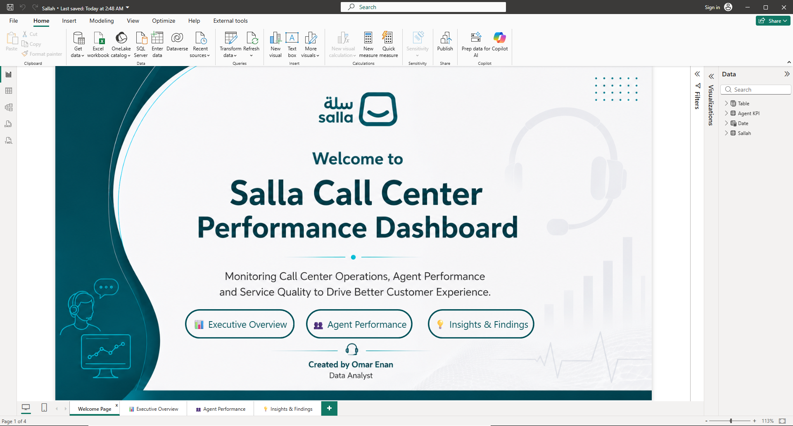
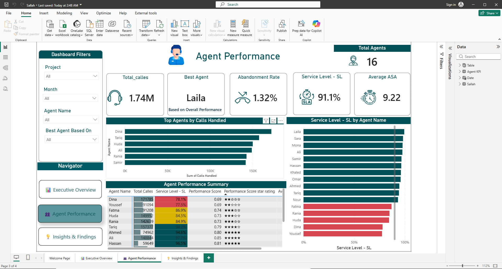
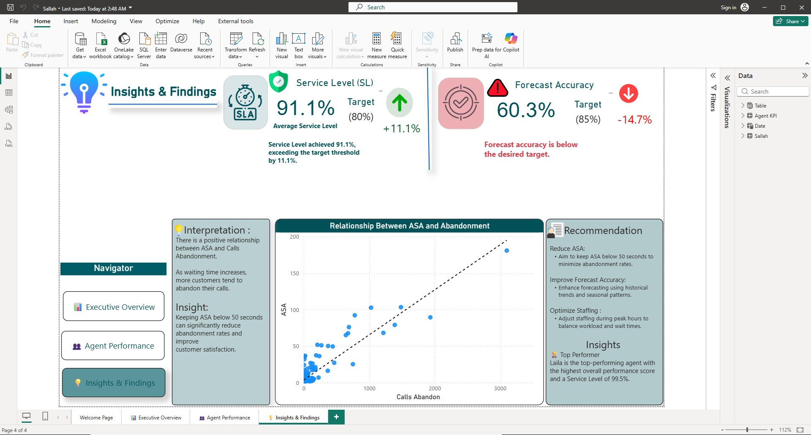

# Salla Call Center Performance Dashboard

## Overview

This project is an interactive Power BI dashboard designed to analyze call center performance and provide actionable business insights.

The dashboard helps monitor operational efficiency, agent performance, forecasting accuracy, customer wait times, and call abandonment trends.

---

## Dashboard Snapshot



---

## Dashboard Pages

### 1. Welcome Page



Landing page designed to provide intuitive navigation across all dashboard sections.

---

### 2. Executive Overview


Provides a high-level overview of key call center KPIs including:

* Total Calls
* Service Level (SL)
* Abandonment Rate
* Forecast Accuracy
* Average ASA

Also includes trend analysis and forecasting performance comparison.

---

### 3. Agent Performance



Analyzes agent productivity and service quality through:

* Agent Ranking
* Performance Score
* Service Level by Agent
* Average ASA
* Calls Handled
* Best Agent Identification

---

### 4. Insights & Findings



Business insights and recommendations derived from the analysis:

* Service Level exceeded target by 11.1%
* Forecast Accuracy is below the desired target
* Positive correlation between ASA and Call Abandonment
* Recommendations to reduce waiting time and improve staffing efficiency

---

## Key KPIs

* Total Calls
* Service Level %
* Abandonment Rate %
* Forecast Accuracy %
* Average Speed of Answer (ASA)
* Calls Handled
* Best Agent
* Agent Performance Score

---

## Tools & Skills Used

* Power BI
* Power Query
* DAX
* Data Modeling
* Data Visualization
* KPI Design
* Business Insights & Recommendations

---

## Project Structure

```text
├── Dataset
│   ├── Sallah Call Center Data Base - Feb.csv
│   ├── Sallah Call Center Data Base - Mar.csv
│   └── Sallah Call Center Data Base - Apr.csv
│
├── Screenshots
│   ├── 01-welcome-page.png
│   ├── 02-executive-overview.png
│   ├── 03-agent-performance.png
│   └── 04-insights-findings.png
│
├── Sallah.pbix
└── README.md
```

---

## Key Business Insight

Analysis revealed a clear positive relationship between Average Speed of Answer (ASA) and Call Abandonment.

As customer waiting time increases, the likelihood of abandoning the call also increases.

The dashboard findings suggest maintaining ASA below 20 seconds to minimize abandonment rates and improve customer experience.

---

## Author

**Omar Enan**

Aspiring Data Analyst passionate about transforming data into actionable insights using Power BI, SQL, Python, and Data Analytics.
